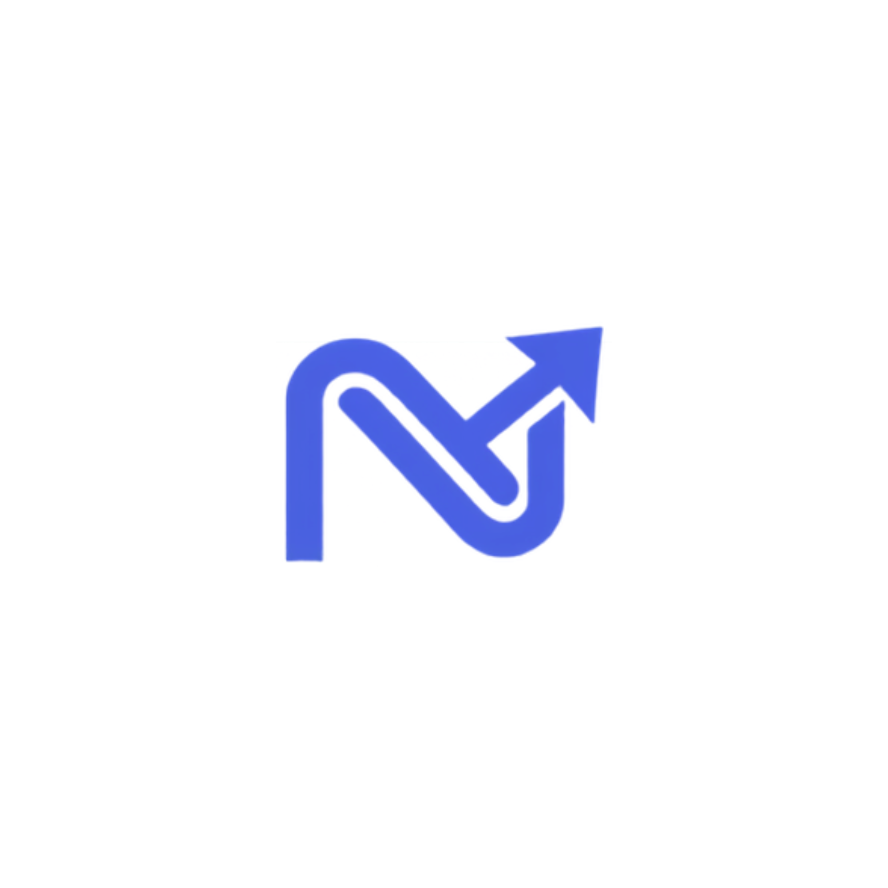

<div align="center">



# payNEXT

**payNEXT is a next-generation digital wallet platform.**

</div>

## 📖 About The Project

payNEXT is a digital wallet platform developed for Web Programming Lab II.

The project uses an MVC-based backend and provides API-driven features for common wallet operations, including:

- Wallet balance management
- Transaction history
- Peer-to-peer money requests
- Merchant payments
- User authentication

The application runs as a Docker-based multi-container system.

## ✨ Features

- 💳 **Digital Wallet**: Manage wallet balances and transactions.
- 🔒 **Automatic HTTPS**: Caddy manages HTTPS and Let's Encrypt certificates.
- 🐳 **Docker Support**: Run the application and its services with Docker Compose.

## 🛠️ Tech Stack

- **Frontend**: HTML, CSS, JavaScript
- **Web Server**: Nginx
- **Backend**: Node.js, Express.js
- **Architecture**: MVC
- **Database**: PostgreSQL 16
- **Reverse Proxy**: Caddy v2
- **SSL/TLS**: Let's Encrypt
- **Containerization**: Docker, Docker Compose
- **CI/CD**: GitHub Actions

## 🏗️ Architecture

payNEXT uses four main services:

1. **Caddy**
   - Receives incoming web traffic.
   - Redirects HTTP traffic to HTTPS.
   - Manages Let's Encrypt certificates.
   - Routes `/api/*` requests to the backend.
   - Routes frontend requests to Nginx.

2. **Web**
   - Runs Nginx.
   - Serves the frontend files.
   - Handles client-side routing.

3. **API**
   - Runs the Node.js and Express.js backend.
   - Handles authentication and wallet operations.
   - Processes transactions and money requests.
   - Communicates with PostgreSQL.

4. **Database**
   - Runs PostgreSQL 16.
   - Stores users, wallets, transactions, money requests, and other application data.

The request flow looks like this:

```text
User
  │
  ▼
Caddy
  │
  ├── / ──────────► Nginx
  │                   │
  │                   ▼
  │                Frontend
  │
  └── /api/* ─────► Node.js
                       │
                       ▼
                   PostgreSQL
```

## 🚀 Getting Started

### Prerequisites

Install these tools before running the project:

- [Docker](https://www.docker.com/get-started)
- [Docker Compose](https://docs.docker.com/compose/)
- [Git](https://git-scm.com/)

### Stopping the Application

Stop the containers with:

```bash
docker compose down
```

To also remove Docker volumes:

```bash
docker compose down -v
```

Use the `-v` option only when you want to remove the stored local database data.

## 🔐 Authentication & Authorization (Lab 05)

### Registration (`POST /api/v1/auth/register`)
Request:
```json
{ "email": "user@test.com", "password": "password123", "fullName": "Test User" }
```
Response (`201 Created`):
```json
{ "success": true, "message": "Registered successfully", "data": { "token": "jwt_string..." } }
```

### Login (`POST /api/v1/auth/login`)
Request:
```json
{ "email": "user@test.com", "password": "password123" }
```
Response (`200 OK`):
```json
{ "success": true, "message": "Login successful", "data": { "token": "jwt_string..." } }
```

### Admin Restricted Endpoint (`GET /api/v1/auth/users`)
Requires: `Authorization: Bearer <ADMIN_TOKEN>`
Response (`200 OK`):
```json
{
  "success": true,
  "data": [
    { "id": 1, "email": "admin@test.com", "role": "admin" },
    { "id": 2, "email": "user@test.com", "role": "user" }
  ]
}
```
If accessed with a standard user token, returns `403 Forbidden`.

payNEXT - Powering Your Next Move. Next Generation Digital Wallet.
